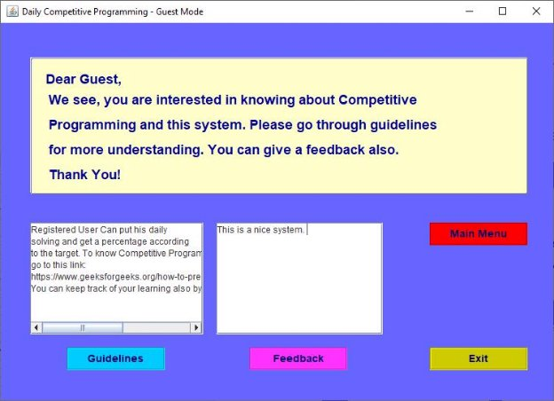
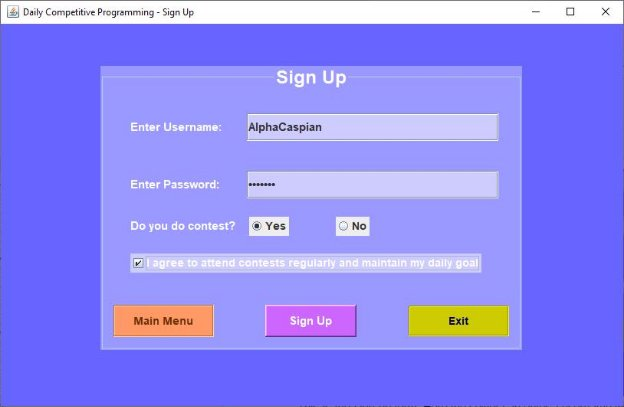
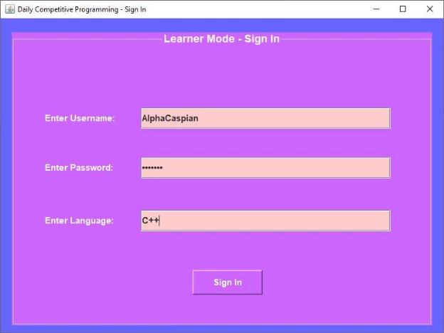
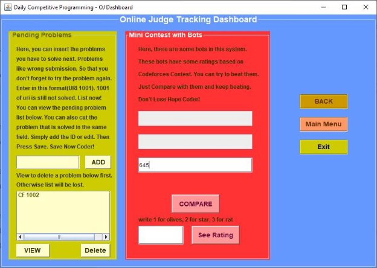

# Daily Competitive Programming - Mini CP Tracker

## Table of Contents

1. [Overview](#overview)
2. [Installation](#installation)
    1. [Windows](#windows)
        1. [Prerequisite: Install OpenJDK 18](#prerequisite-install-openjdk-18)
        2. [Download and Run the Application](#download-and-run-the-application)
    2. [Linux](#linux)
        1. [Prerequisite: Install OpenJDK 18](#prerequisite-install-openjdk-18)
        2. [Troubleshooting Steps](#troubleshooting-steps)
        3. [Download and Run the Application](#download-and-run-the-application)
3. [Guideline Tutorial](#guideline-tutorial)
4. [Goals](#goals)
5. [Specifications](#specifications)
6. [Project’s Guideline](#projects-guideline)
7. [Conclusion](#conclusion)

 
## Overview

“Daily Competitive Programming” is a Desktop Application developed in Java Programming Language. Often Beginners in competitive programming face some problems to find their strategy to improve. Keeping track of our daily activity on competitive programming is the most important thing in this sector. So, I have come up with a plan to develop such a tracker with my present knowledge. It is a mini application with some tracking features. 

## Installation

I suggest you to follow the steps properly and patiently. I tried to make it as simple as possible and highlighted the issues with solution that I faced running the appplication.

### Windows

#### Prerequisite: Install OpenJDK 18

Before using this application on Windows, you need to ensure that you have OpenJDK 18 installed. Here are the steps:

1. Download and install OpenJDK 18 for Windows from the official AdoptOpenJDK website: [Download Java 18](https://adoptium.net/releases.html?variant=openjdk18&jvmVariant=hotspot).

2. Follow the installation instructions provided on the website.

#### Download and Run the Application

Now, you can download and run the application:

1. Download the full repository from the GitHub page. Click the "Download" button or use the following link: [Download Repository](https://github.com/Samia35-2973/Daily-Competitive-Programming-Mini-Java-OOC-Project/archive/refs/heads/master.zip).

2. Extract the downloaded ZIP file to a location of your choice on your Windows system.

3. Open a Command Prompt and navigate to the directory where you extracted the repository. For example:

   ```bash
   cd path\to\Daily-Competitive-Programming-Mini-Java-OOC-Project\out\artifacts
   ```

4. To run the application, use the following command:

   ```bash
   java -jar "Daily-Competitive-Programming-Mini-Java-OOC-Project.jar"
   ```

### Linux

#### Prerequisite: Install OpenJDK 18

Before using this application on Linux, you need to ensure that you have OpenJDK 18 installed. Here are the steps:

1. Open a terminal.

2. Update your package repository:

   ```bash
   sudo apt update
   ```

3. Install OpenJDK 18 with the following commands:

   ```bash
   sudo apt install software-properties-common
   sudo add-apt-repository ppa:adoptopenjdk/ppa
   sudo apt update
   sudo apt install adoptopenjdk-18-hotspot
   ```

#### Troubleshooting Steps

If you experienced issues running the application with Java 18, here's how you resolved the problem:

You can download and install it in /opt/ so it does not interfere with the currently installed version. Commands:

Download:

```bash
wget https://download.java.net/java/GA/jdk18/43f95e8614114aeaa8e8a5fcf20a682d/36/GPL/openjdk-18_linux-x64_bin.tar.gz
```
Extract the download (replace {version} with the one downloaded):

```bash
tar -xvf openjdk-18._linux-{version}
```
Move it to /opt/:

```bash
sudo mv jdk-18* /opt/
```
(replace jdk-18 to something else if you want) and set the environment variables:

```bash
export JAVA_HOME=/opt/jdk-18
export PATH=$PATH:$JAVA_HOME/bin
```

To check if that went correctly:

```bash
cd /opt/jdk-18/
java --version
echo $JAVA_HOME
```

If you've correctly updated the JAVA_HOME and PATH environment variables, and the /opt/jdk-18/bin directory is in the path before other directories containing Java binaries. However, the issue is persisting. To troubleshoot further, you can consider the following steps:

Check Symlinks: It's possible that you have symbolic links to Java binaries that are pointing to a different Java version. Use the which command to check the location of the java command:

```bash
which java
```
This will show the full path to the java binary. Make sure it points to /opt/jdk-18/bin/java. If not-

You can manually create an alternative for Java 18:

1. Create an alternative for Java 18:

   ```bash
   sudo update-alternatives --install /usr/bin/java java /opt/jdk-18/bin/java 1
   ```

   This command instructs the system to create a new alternative named `java` that points to the `java` executable in the `/opt/jdk-18` directory. The `1` at the end signifies the priority (higher number means higher priority).

2. Set Java 18 as the default:

   ```bash
   sudo update-alternatives --config java
   ```

   You should see a list of alternatives. Select the number corresponding to the Java 18 installation in `/opt/jdk-18`.

3. Verify the change:

   ```bash
   java --version
   ```

   It should now display the version information for Java 18.

#### Download and Run the Application

Now, you can download and run the application:

1. Download the full repository from the GitHub page. Click the "Download" button or use the following link: [Download Repository](https://github.com/Samia35-2973/Daily-Competitive-Programming-Mini-Java-OOC-Project/archive/refs/heads/master.zip).

2. Extract the downloaded ZIP file to a location of your choice on your Linux system.

3. Open a terminal.

4. Navigate to the directory where you extracted the repository:

   ```bash
   cd path/to/Daily-Competitive-Programming-Mini-Java-OOC-Project/out/artifacts
   ```

5. To run the application, use the following command:

   ```bash
   java -jar "Daily-Competitive-Programming-Mini-Java-OOC-Project.jar"
   ```

Enjoy using the Daily Competitive Programming Mini Java OOC Project!

## Guideline Tutorial

[Java Project.mp4](https://drive.google.com/file/d/1fn6iAJsjoRrJGpiSft_2IThvLzD8VcDc/view?usp=sharing)


## Goals

- **Track Problem Solving:** It is designed specially for competitive programmers who want to keep track of their daily problem solving and coding activities. 
- **Track Learning Progress:**  Anyone can keep the daily learning activity on a track so that he/she will be able to see the progress done so far.**  
- **Feedback on Progress:**  Users of the application will get timely feedback on their progress to not lose hope on Competitive Programming. 

## Specifications

Students like me will get a lot of benefits by using the system as well as building a beginner strategy. This is a mini project built with Java Swing (GUI), Object Oriented Concepts using Java Language. 

## Project’s Guideline 

This is a simple project. Only one person from one device can save their record in this system. If they sign up again the previous record will simply vanish away. This is just a mini project. I will try to update it further with my knowledge.  

**Home**


This is the Home screen of the Daily Competitive Programming System. Users can select their desired mode. 

- **Guest Mode**: If a user doesn’t want to sign up yet but wants to know some details of the system and its use, then he/she can select this mode. After selecting this mode the following screen will appear. 


In the guidelines mode we can see guidelines like the given screenshot below. We can also give feedback about the system. 



Now if we submit the feedback a message will show like the given screenshot below: 


If the guest wants to go back to the main menu, he/she can press the button “main menu”. If he wants to exit then press the exit button. 

- **Sign Up**: Now if the user wants to use the system as a Solver and enjoy the features, he/she has to sign up from the main menu. If the user already has an account remember the previous record will be gone.  


This is the sign up form. Here the solver can enter a username with more than 4 characters and a password with more than 6 characters. Otherwise it won’t register. The solver has to have previous experience in the contest. If the solver presses no, the sign up won’t process. That’s not all, If the solver doesn’t check the condition he won’t be able to sign up. He has to agree with the condition to attend contests and maintain the goal. So the sign up procedure will be like below: 



After giving every detail like above the solver can sign up, the window will appear like below. Also if the solver is not ready yet he can choose to go to the main menu or exit from the system. 


- **Sign In:** A registered solver can sign in to see the main tracker sheet. After pressing the sign in button from the main menu, the solver has to give the details to access the features inside the system. If the solver gives the wrong username or password he can’t access it. 


After successful sign in a window will appear like below: 


This is the main dashboard for the Solver. Here can do anything to track his details. 

A new solver cannot directly enter the total solve area without setting a target like 

below  

.  

Also the solver cannot enter anything without a digit like below: 


1. **Set Target:** A solver has to set a daily target. He has to fulfill this target to reach his goal. This is a beginner's step in competitive programming. 


Now the solver has set the target to 5. He has to complete this target daily. He can also change target anytime. 


2. **Add total solve of the day:** Now if we input the day and add our total solve like above, we will see a feedback and a report like below: 


This is the feedback based on the day and target. 


In the red box we can see the report of the day based on our daily target. 

3. **Total and Progress:** In the purple box, if the solver wants to see the total solve that he has done so far, he can press Total in the maroon box. He will be able to see. If he wants to see all the progress history, he can click the progress. This progress includes the date, solve, feedback and percentage of target achievement with target. Example is given below: 


4. **Feedback Generator**: If a solver wants to see how the feedback works, he can select the percentage to generate it. Example is given below: 


Choosing 31-60% will generate feedback like below: 


5. **Feedback:** If a solver wants to give feedback he can write something on the yellow feedback field and press Feedback. 
6. **Learner Mode:** To access the learner mode for a solver has to login first. In the login the learner will enter the language of his Competitive Programming topic for the day. 



After successful login it will give the solver access to the learning mode. 


This is the learner’s dashboard. Solver can enter the topic that he has learned. In this way he will be able to see what he has learned and what he needs to learn next. Without learning, the solver cannot compete. 


After entering the topic if the learner wants to see the list of his learning he can view it. 


After viewing this is the list that will show for the language c++. Learners can change language during sign in. Now if we go again to the solver mode and check the OJ mode. 

7. **OJ Mode:** Below is the dashboard of OJ mode.  
- Pending Problems: Now if the solver gets a wrong answer or is confused about a problem, he can list the problem on the yellow box by ADD. By this feature he can add the problem that he will solve in future. 


by adding this problem will show a window like below 


If the solver wants to view the problem list that he needs to solve, he can click VIEW 


We can see the pending problems here. Now if the solver solved the problem URI 1002, he can erase that problem in the box and click DELETE. This will save the process.  

But there is a CAUTION. If the solver doesn’t view first and press delete, all records will get deleted. So the solver has to view first, in order to delete. 


- **Mini Contest With Bot**: In the red 3rd box, solver can enter his/her coderforces current ratings and compare with the system's bots.  



After comparing, the result will show like below 

Here Olive is a system, which the solver beats 


Now if the contestant wants to see the ratings of the system’s bots, he/she can click “See Rating” by giving the serial number of the bot. 


Here Stars rating is 1200.  

8. **Admin**: After going to the main menu, the admin of the system can login into the system. 


This code and ID is only for the admin. No other person except the admin will know the access area. After successful Access admin dashboard will show like below 


- **User Progress History:** Here admin can see the progress history of the solvers. 
- **Feedbacks of System:** Admin will be able to see the feedbacks about the system 
- **System User List:** Admin will be able to see all the list of users. 

The Example of this 3 area is given below 


## Conclusion

This  is  how  the  system  works.  Competitive  Programmers  can  use  this  app  to  track  his programming activity on a daily life basis. This will help the beginners to reach his goal easily. 
